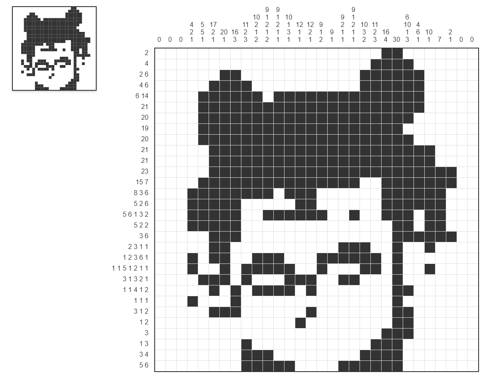

# 🎨 Nonogram: Image to Number Puzzle Tool - 图片转数织谜题工具

[中文](README.md) | [English](README_EN.md)

✨ 将任意图片转换为可交互的数织谜题，支持实时编辑与预览！基于纯前端技术实现，无需服务器。



## 🌟 功能亮点

- 🖼️ **图片一键转换** - 支持 JPG/PNG 图片上传，自动生成数织谜题
- 🧩 **智能识别算法**- 自适应阈值处理，精准识别图形轮廓
- ✏️ **交互式编辑** - 点击修改单元格，实时同步预览
- 📱 **响应式设计** - 完美适配桌面/移动设备
- 🎮 **双视图模式** - 左侧缩略图预览，右侧完整谜题界面
- ⚡ **实时渲染** - 修改即时生效，所见即所得

## 🚀 快速开始

### 在线体验

直接访问 [Online Pages](https://nonograms.numkid.com/)

### 本地运行

```bash
git clone https://github.com/yourusername/picross-generator.git
cd picross-generator
# 直接打开index.html即可
```

## 🛠️ 使用指南

1. **上传图片** - 点击选择本地图片文件（建议使用高对比度图片）
2. **自动生成** - 系统将自动生成 20x20 的数织网格(修改**SIZE**参数，调整网格大小)
3. **编辑谜题**：
   - 左键点击填充单元格
   - 再次点击取消填充
   - 实时查看左侧缩略图变化
   - **保存结果** - 右键点击网格区域保存为 PNG

## 🧠 技术特性

- **核心算法**：基于 Luminance 阈值的图像二值化处理
- **性能优化**：Canvas 动态渲染 + 网格虚拟化
- **交互设计**：自适应触摸/鼠标事件
- **代码规范**：ES6 模块化 + 响应式数据流

## 🛠️ 自定义配置

```
const SIZE = 20;          // 网格尺寸
const THRESHOLD = 128;    // 二值化阈值(0-255)
const CELL_SIZE = 25;     // 单元格像素大小
```

## 🤝 参与贡献

欢迎提交 PR！建议流程：

1. Fork 项目
2. 创建特性分支 (git checkout -b feature/AmazingFeature)
3. 提交修改 (git commit -m 'Add some AmazingFeature')
4. 推送分支 (git push origin feature/AmazingFeature)
5. 发起 Pull Request

## 📄 许可证

[MIT License](./LICENSE)
