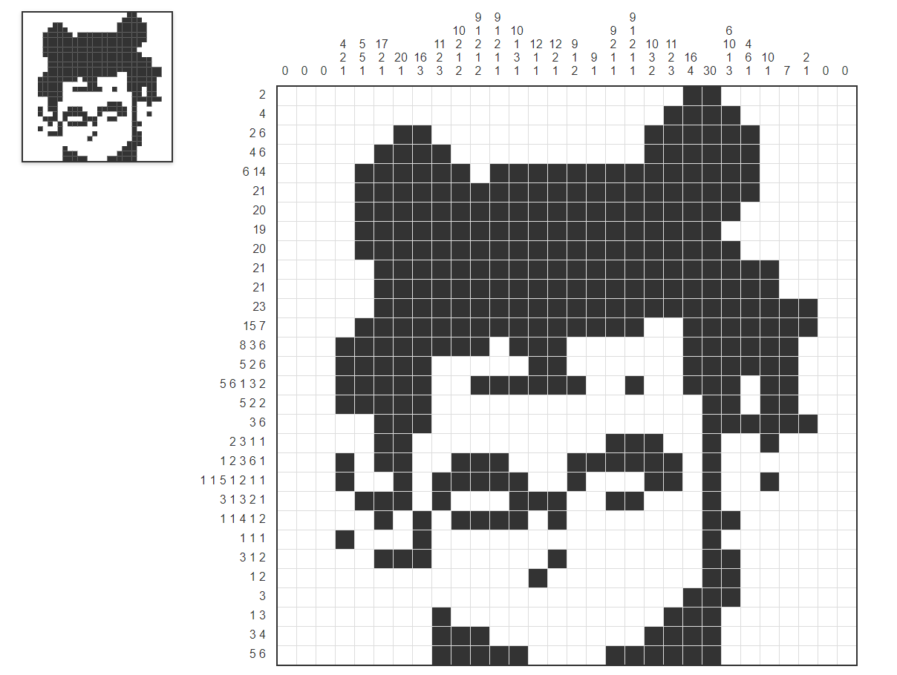

# 🎨 Nonogram: Image to Number Puzzle Tool

[中文](README.md) | [English](README_EN.md)

✨ Convert any image into an interactive Nonogram puzzle with real-time editing and preview! Built with pure front-end technology, no server required.



## 🌟 Features

- 🖼️ **One-Click Image Conversion** - Supports JPG/PNG image uploads and automatically generates Nonogram puzzles
- 🧩 **Smart Recognition Algorithm** - Adaptive threshold processing for accurate shape recognition
- ✏️ **Interactive Editing** - Click to modify grid cells with real-time preview
- 📱 **Responsive Design** - Optimized for both desktop and mobile devices
- 🎮 **Dual-View Mode** - Thumbnail preview on the left, full puzzle on the right
- ⚡ **Instant Rendering** - Real-time updates, what you see is what you get

## 🚀 Try Online

### Try Online

Visit [Online Pages](https://nonograms.numkid.com/)

### Run Locally

```bash
git clone https://github.com/yourusername/picross-generator.git
cd picross-generator
# Open index.html directly
```

## 🛠️ How to Use

1. **Upload an Image** - Click to select a local image file (high-contrast images are recommended)
2. **Automatic Generation** - The system automatically creates a 20x20 Nonogram grid (adjust grid size by modifying the _SIZE_ parameter)
3. **Edit the Puzzle**：
   - Left-click to fill a cell
   - Click again to remove the fill
   - See real-time changes in the thumbnail preview
   - **Save the result** - Right-click the grid area to save as PNG

## 🧠 Technical Features

- **Core Algorithm**: Image binarization based on luminance threshold
- **Performance Optimization**: Dynamic rendering with Canvas + grid virtualization
- **Interactive Design**: Adapts to both touch and mouse events
- **Code Structure**: ES6 modularization + reactive data flow

## 🛠️ Custom Configuration

```
const SIZE = 20;          // Grid size
const THRESHOLD = 128;    // Binarization threshold (0-255)
const CELL_SIZE = 25;     // Cell pixel size
```

## 🤝 Contributing

Contributions are welcome! Suggested workflow:

1. Fork the project
2. Create a feature branch (git checkout -b feature/AmazingFeature)
3. Commit your changes (git commit -m 'Add some AmazingFeature')
4. Push to the branch (git push origin feature/AmazingFeature)
5. Open a Pull Request

## 📄 License

[MIT License](./LICENSE)
